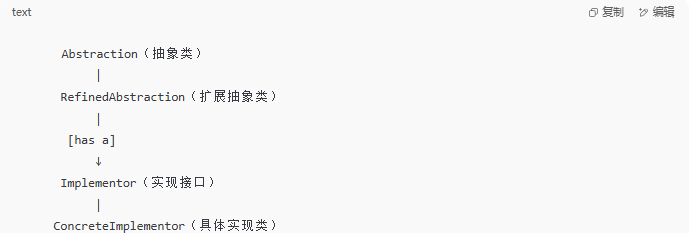

一、桥接模式的核心思想
在传统的继承结构中，如果“抽象”和“实现”混在一起，会导致类爆炸：

例如你有一个图形类 Shape，可能有两个维度的变化：

形状：圆形、正方形、三角形……

颜色：红色、绿色、蓝色……

如果你每种形状和颜色组合都写一个类，那就会产生 CircleRed, CircleGreen, SquareRed, SquareGreen…… 类爆炸。

🔗 桥接模式解决这个问题的办法是：将“形状”与“颜色”两个维度分开，让它们之间通过组合（桥接）而不是继承联系起来。

二、类图结构

Implementor：实现部分的接口，定义底层的实现行为。

RefinedAbstraction：Abstraction 的子类，扩展 Abstraction 定义的接口。

ConcreteImplementor：Implementor 的具体实现。