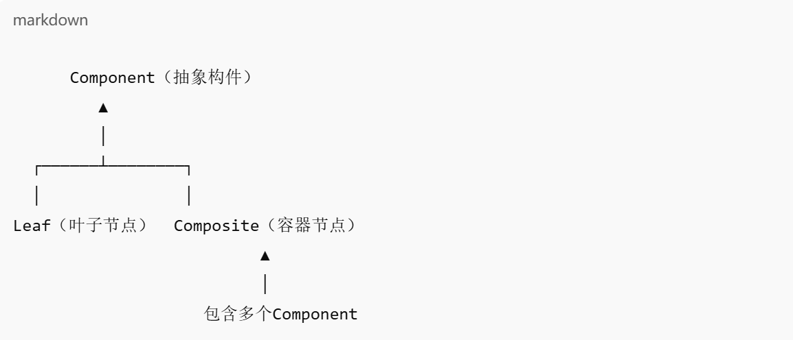
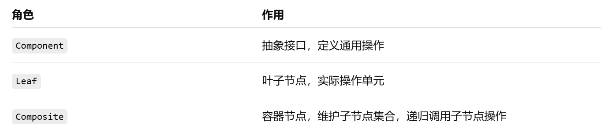

组合模式（Composite Pattern）是 结构型设计模式 之一，用于将对象组合成树形结构，以表示“部分-整体”的层次结构，使得客户端对单个对象和组合对象的使用具有一致性。

✨ 一句话理解
把一组对象当作一个对象来处理。 单个对象（叶子节点）和组合对象（容器节点）实现统一的接口，客户端无需关心是单个还是组合对象。

🧱 模式结构（类图）

✅ 适用场景
希望客户端可以统一处理 个体对象 和 组合对象

表示树形结构，如：文件夹-文件、公司组织结构、图形组件等

💡 关键角色说明
