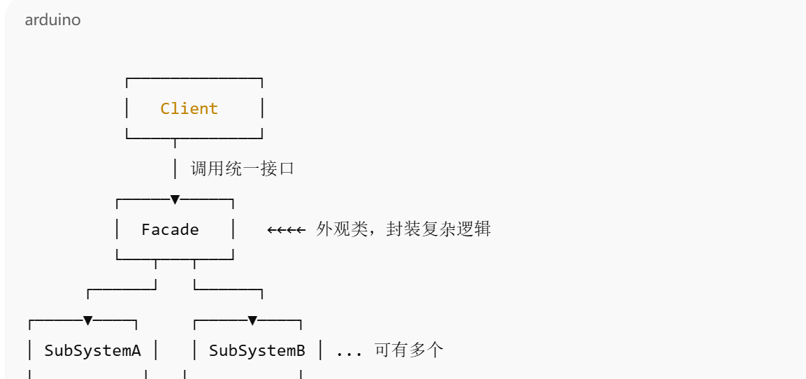

外观模式（Facade Pattern）
🧠 定义
外观模式为子系统中的一组接口提供一个一致的高层接口，使得子系统更易使用。它通过封装复杂子系统的调用逻辑，对外暴露一个统一的接口，屏蔽内部细节。

🎯 使用场景
想让客户端与复杂系统解耦。

子系统越来越复杂，增加一个外观类可以简化使用。

多个子系统存在依赖，提供一个统一的入口。

优点

1. 简化客户端调用，降低耦合。

2. 更好地划分层次。

3. 避免子系统之间直接交互，减少依赖。

缺点

1. 不符合开闭原则，增加子系统行为时，可能需要修改外观类。

2. 外观模式本质是个中转站，对性能有轻微影响（但影响一般可忽略）。

