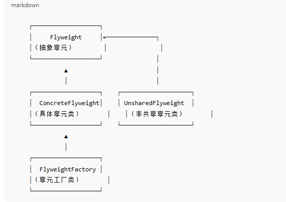
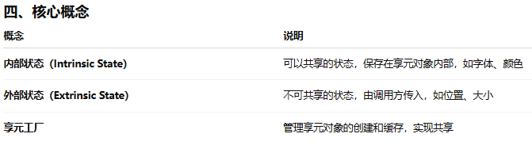

ChatGPT 说：
享元模式（Flyweight Pattern）是结构型设计模式之一，核心目的是：通过共享相同对象来减少内存使用，提高性能。

一、定义
享元模式使用共享技术来有效地支持大量细粒度对象的复用。

当系统中存在大量重复对象时，如果能将相同状态的对象共享，就可以大幅度减少内存消耗。

二、使用场景
适用于以下情况：

系统中有大量相似的对象。

这些对象中有可以共享的内部状态（Intrinsic State）。

剩余状态可以通过外部传入（外部状态 Extrinsic State）。

